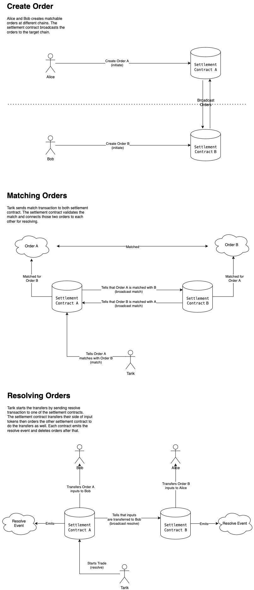

# SwapZilla 🦕 - Decentralized cross-chain swaps via LayerZero
Create orders on one chain, match on another, execute swaps across networks—all without transferring assets to a bridge.

 

## 📖 About The Project

SwapZilla is a decentralized protocol enabling direct asset swaps across different blockchain networks. It leverages LayerZero for cross-chain communication and implements the Uniswap's IERC7683 interface, enhancing its interoperability and standardization. The protocol's key advantage is facilitating token exchanges without relying on traditional bridge transfers.

🔗 More on [The ETHGlobal Official Showcase Page](https://ethglobal.com/showcase/swapzilla-cx3vt)

🔗 [Live Demo](https://669355da9c1981ff216b3d1d--swapzilla.netlify.app/)

 

## 🏆 Rewards

- Blockscout - Best use of Blockscout Block Explorer pool prize.

 

## 🌟 Project Development Progress

SwapZilla is builded in the ETHGlobal Brussels Hackathon held at the The EGG, Belgium from 12th to 14th July 2024.

 

## 🤝 Team

- **Tarık Kızıltan:** Contract design and development using Hardhat ( Solidity), Contract-UI interactions development.
- **Hüseyin Karataş:** UI/UX design and front-end development using Vite (React + JavaScript), TailwindCSS, Aceternity UI, shadcn/ui, Framer Motion, and Flowbite. Basic WalletConnect configurations.
- **Sude Yücel:** Brand design

 

## 🛠️ Technologies Used

- Hardhat (Solidity)
- LayerZero
- Blockscout
- WalletConnect
- Vite (React.js with JavaScript)
- TailwindCSS
- Aceternity UI
- shadcn/ui
- Framer Motion
- Flowbite Blocks

 

## ⚙️ Algorithm Overview

### Example Scenario
Alice (on Base) and Bob (on Scroll) create swap orders. Orders are broadcast across both chains. A solver identifies the complementary nature of their orders. The protocol validates and matches the orders. Upon resolution, Alice's Base tokens are transferred to Bob, and Bob's Scroll tokens to Alice.

 

## 🛠️ Screenshots From The App

  

  

  

  

  

